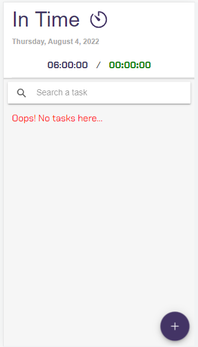
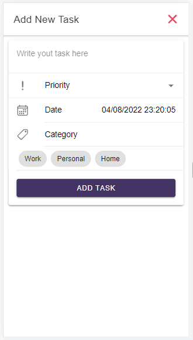
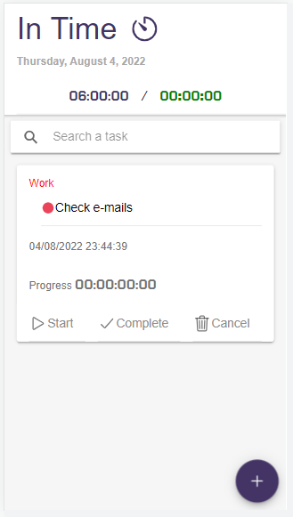
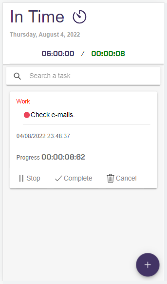

# In-Time-u4crypto

In Time é a ferramenta criada para ajudar um estagiário a gerenciar o seu tempo de trabalho no início da carreira.

Gerencie suas tarefas de forma que o seu tempo seja otimizado ao máximo dentro do limite de 6 horas por dia.

1. Clique no botão de "+" para adicionar uma tarefa - Crie quantas tarefas desejar, fique à vontade!
3. Existe algumas informações que você tem que preencher para ter uma gestão melhor do seu tempo.
4. Após ter preenchido as informaçôes, clique em "ADD TASK".
5. Dentro de cada tarefa existem recursos para gerenciar - Comece apertando "Start" e sua jornada começará! 

<table>
  <tr>
    <td valign="top"></td>
   <td valign="top"></td>
    <td valign="top"></td>
    <td valign="top"></td>
</table>

## Coisas que você precisa saber

- Basta o primeiro start de tarefa no dia e a sua jornada de trabalho começará.
- Só é possível executar uma tarefa por vez.
- Ao utilizar o recurso de "Stop", apenas o andamento da tarefa em questâo vai congelar.
